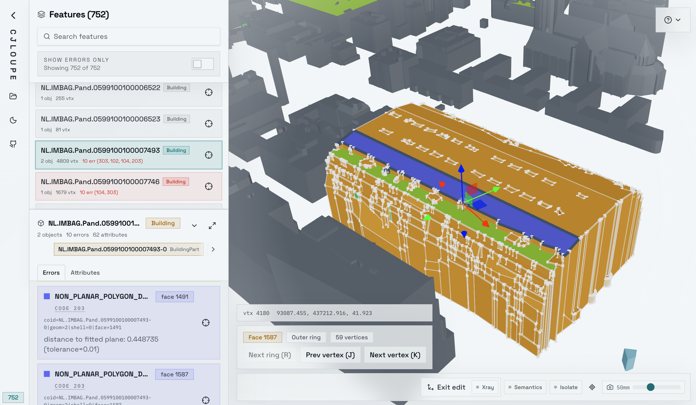

# CJLoupe

CityJSONL 3D viewer and inspection tool with support for val3dity annotations.

It was built specifically to inspect errors in CityJSONL geometries, with the ability to investigate how the geometry is actually structured down to the vertex level.

This app was built almost entirely through vibe coding, mostly with Codex 5.4, though I still spent more than three full days supervising and scrutinizing the agent to make sure it worked the way I wanted.



## Current capabilities

- 3D viewport for CityJSON feature sequences
- Collapsible left sidebar with feature list, and feature details
- Semantic surfaces visualisation
- val3dity report loading and error visualization
- Edit mode with face selection, ring cycling, vertex selection, and vertex movement
- simple mobile UI without edit mode

## Development

```bash
nix develop
bun install
bun dev
```

Other useful commands:

```bash
bun run build
bun run lint
```

## Data Loading

The app loads a bundled sample on startup and also supports local files.

- CityJSON feature sequences: `.jsonl`, `.city.jsonl`
- val3dity reports: `.json`

You can load files in two ways:

- Use the file controls in the left rail or file cards
- Drag and drop files into the window

When a dataset is already open, the file action lets you either replace the current CityJSON sequence or attach a matching val3dity report.

## Geometry selection

The loader currently chooses one geometry per CityObject.

- It picks the highest numeric LoD available
- If two geometries have the same LoD, it prefers `Solid` over surface geometry
- It prefers renderable leaf objects over parents when both are present
