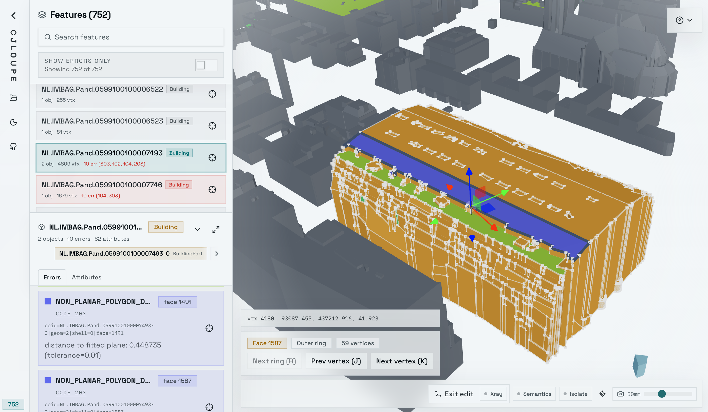

# CJLoupe

CityJSON 3D viewer and inspection tool with support for val3dity annotations. Also an experiment in learning how to use coding agents effectively.

It started out specifically to inspect errors in CityJSON geometries, with the ability to investigate how the geometry is actually structured down to the vertex level.



## Current capabilities

- Loading of [CityJSON](https://www.cityjson.org/specs/) files and [CityJSON feature sequences](https://www.cityjson.org/cityjsonseq/)
- 3D viewport with arcball navigation and object picking
- [val3dity](https://github.com/tudelft3d/val3dity) report loading and error visualization (generate with the val3dity `--report` flag)
- Collapsible left sidebar with feature list, and feature details (attributes, val3dity errors, geometries)
- Semantic surfaces visualisation
- Edit mode with face selection, ring cycling, vertex selection, and vertex movement
- LoD selection
- Shareable viewer state, including camera, selection, appearance, isolation, and inspect settings
- Simple mobile UI without edit mode

## Development

```bash
nix develop
bun install
bun dev
```

Other useful commands:

```bash
bun run build
bun run lint
bun test
```

## Data Loading

The app opens a file chooser on startup, where you can load the bundled example or your own files.

- CityJSON: `.json`, `.city.json`, `.cityjson`
- CityJSON feature sequences: `.jsonl`, `.city.jsonl`
- val3dity reports: `.json`

You can load files in two ways:

- Use the file controls in the left rail
- Drag and drop files into the window

When a dataset is already open, the file action lets you either replace the current CityJSON dataset or attach a matching val3dity report.

## Sharing a view

Use the Share button in the left rail to capture the current viewer state.

- A scene loaded entirely from URLs copies a link containing the existing `cj`/`val` parameters and a base64url-encoded `state` parameter.
- A single local CityJSON source downloads a `.cjloupe.city.json` or `.cjloupe.city.jsonl` copy containing the viewer state.
- Multi-file, mixed-source, or standalone-report scenes download a `.cjloupe.zip` bundle. Extract the bundle before opening or dropping its files into CJLoupe.

State-enriched CityJSON files remain regular CityJSON data. CJLoupe stores its state in the optional `+CJLoupe-viewerState` root member; other readers can ignore it. An explicit URL state takes precedence over embedded file state. Geometry edits are not included in shared state or written into downloaded source files.

## Limitations
- No handling of [Appearance objects](https://www.cityjson.org/specs/2.0.2/#appearance-object)
- The 'Best LOD' selection, does not show the parent object if child objects have a geometry as well.
